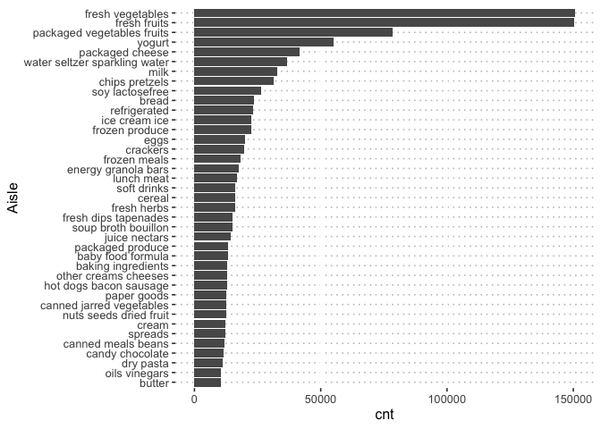

p8105_hw3_yq2378
================
Qi Yumeng
2023-10-07

The goal is to do some exploration of this dataset. To that end, write a
short description of the dataset, noting the size and structure of the
data, describing some key variables, and giving illustrative examples of
observations. Then, do or answer the following (commenting on the
results of each):

How many aisles are there, and which aisles are the most items ordered
from? Make a plot that shows the number of items ordered in each aisle,
limiting this to aisles with more than 10000 items ordered. Arrange
aisles sensibly, and organize your plot so others can read it. Make a
table showing the three most popular items in each of the aisles “baking
ingredients”, “dog food care”, and “packaged vegetables fruits”. Include
the number of times each item is ordered in your table. Make a table
showing the mean hour of the day at which Pink Lady Apples and Coffee
Ice Cream are ordered on each day of the week; format this table for
human readers (i.e. produce a 2 x 7 table).

``` r
library(p8105.datasets)
library(tidyverse)
```

    ## ── Attaching packages ─────────────────────────────────────── tidyverse 1.3.0 ──

    ## ✔ ggplot2 3.4.3     ✔ purrr   1.0.2
    ## ✔ tibble  3.2.1     ✔ dplyr   1.1.3
    ## ✔ tidyr   1.3.0     ✔ stringr 1.5.0
    ## ✔ readr   2.1.4     ✔ forcats 1.0.0

    ## ── Conflicts ────────────────────────────────────────── tidyverse_conflicts() ──
    ## ✖ dplyr::filter() masks stats::filter()
    ## ✖ dplyr::lag()    masks stats::lag()

``` r
library(ggpubr)
```

``` r
data("instacart")
head(instacart)
```

    ## # A tibble: 6 × 15
    ##   order_id product_id add_to_cart_order reordered user_id eval_set order_number
    ##      <int>      <int>             <int>     <int>   <int> <chr>           <int>
    ## 1        1      49302                 1         1  112108 train               4
    ## 2        1      11109                 2         1  112108 train               4
    ## 3        1      10246                 3         0  112108 train               4
    ## 4        1      49683                 4         0  112108 train               4
    ## 5        1      43633                 5         1  112108 train               4
    ## 6        1      13176                 6         0  112108 train               4
    ## # ℹ 8 more variables: order_dow <int>, order_hour_of_day <int>,
    ## #   days_since_prior_order <int>, product_name <chr>, aisle_id <int>,
    ## #   department_id <int>, aisle <chr>, department <chr>

The data has 1384617 observations of 15 variables, where each row in the
dataset is a product from an order. `order_id` is order identifier.
`user_id` is customer identifier. `order_dow` is the day of the week on
which the order was placed. `order_hour_of_day` is the hour of the day
on which the order was placed. `product_name` is the name of the
product. `aisle` is the name of the aisle. `department` is the name of
the department.

There are 134 unique aisles and fresh vegetables is the most items
ordered from. Fresh fruits comes the second and packaged vegetables
fruit comes the third.

``` r
instacart %>% group_by(aisle) %>% summarise(cnt = n()) %>% arrange(desc(cnt))
```

    ## # A tibble: 134 × 2
    ##    aisle                            cnt
    ##    <chr>                          <int>
    ##  1 fresh vegetables              150609
    ##  2 fresh fruits                  150473
    ##  3 packaged vegetables fruits     78493
    ##  4 yogurt                         55240
    ##  5 packaged cheese                41699
    ##  6 water seltzer sparkling water  36617
    ##  7 milk                           32644
    ##  8 chips pretzels                 31269
    ##  9 soy lactosefree                26240
    ## 10 bread                          23635
    ## # ℹ 124 more rows

Grouped the data by aisle and reorder the data by the number of items
ordered in each aisle, we could easily see that the number of fresh
vegetables and fruits are almost twice as that of packaged vegetables
fruits. The least popular items are dry pasta, oil vinegars and butter.

``` r
instacart %>% group_by(aisle) %>% summarise(cnt = n()) %>%  filter(cnt>10000) %>% 
  ggplot(aes(x = reorder(aisle, cnt), y = cnt))+ geom_bar(stat="identity") + coord_flip() +
  xlab("Aisle") + theme_pubclean()
```

<!-- --> The
three most popular items in “baking ingredients”, “dog food care”, and
“packaged vegetables fruits” were listed below. For packaged vegetables,
the hit products are Organic Baby Spinach, Organic Raspberries and
Organic Blueberries. For baking ingredients, the hit products are Light
Brown Sugar, Pure Baking Soda and Cane Sugar. For dog food care, the hit
products are Snack Sticks Chicken & Rice Recipe Dog Treats, Organix
Chicken & Brown Rice Recipe and Small Dog Biscuits

``` r
instacart %>% filter(aisle %in% c("baking ingredients","dog food care","packaged vegetables fruits")) %>% group_by(aisle,product_name) %>% summarise(cnt = n()) %>% arrange(desc(cnt)) %>% slice(1:3)%>% arrange(desc(cnt))
```

    ## `summarise()` has grouped output by 'aisle'. You can override using the
    ## `.groups` argument.

    ## # A tibble: 9 × 3
    ## # Groups:   aisle [3]
    ##   aisle                      product_name                                    cnt
    ##   <chr>                      <chr>                                         <int>
    ## 1 packaged vegetables fruits Organic Baby Spinach                           9784
    ## 2 packaged vegetables fruits Organic Raspberries                            5546
    ## 3 packaged vegetables fruits Organic Blueberries                            4966
    ## 4 baking ingredients         Light Brown Sugar                               499
    ## 5 baking ingredients         Pure Baking Soda                                387
    ## 6 baking ingredients         Cane Sugar                                      336
    ## 7 dog food care              Snack Sticks Chicken & Rice Recipe Dog Treats    30
    ## 8 dog food care              Organix Chicken & Brown Rice Recipe              28
    ## 9 dog food care              Small Dog Biscuits                               26

Make a table showing the mean hour of the day at which Pink Lady Apples
and Coffee Ice Cream are ordered on each day of the week; format this
table for human readers (i.e. produce a 2 x 7 table).

The table shows the mean hour of the day at which Pink Lady Apples and
Coffee Ice Cream are ordered on each day of the week.

``` r
#lookup = c(0 ="Sun",1 ="Mon",2= "Tue",3="Wed",4="Thu",5="Fri",6="Sat")
df_temp = instacart %>% filter(product_name %in% c("Pink Lady Apples","Coffee Ice Cream")) %>% group_by(order_dow,product_name) %>% summarise(mean_order_hour_of_day = round(mean(order_hour_of_day),2)) %>% pivot_wider(names_from = order_dow,values_from = mean_order_hour_of_day)
```

    ## `summarise()` has grouped output by 'order_dow'. You can override using the
    ## `.groups` argument.

``` r
names(df_temp) = c("product name","Sun","Mon","Tue","Wed","Thu","Fri","Sat")
df_temp
```

    ## # A tibble: 2 × 8
    ##   `product name`     Sun   Mon   Tue   Wed   Thu   Fri   Sat
    ##   <chr>            <dbl> <dbl> <dbl> <dbl> <dbl> <dbl> <dbl>
    ## 1 Coffee Ice Cream  13.8  14.3  15.4  15.3  15.2  12.3  13.8
    ## 2 Pink Lady Apples  13.4  11.4  11.7  14.2  11.6  12.8  11.9
